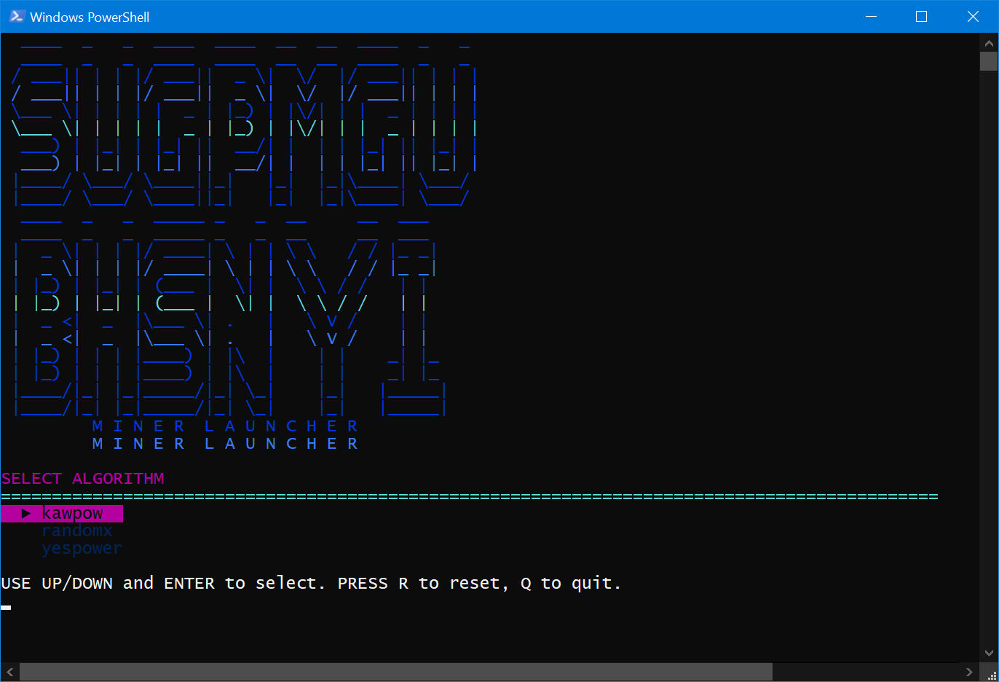

# Sugpmgu 🚀 Bhsbyi

**Sugpmgu 🚀 Bhsbyi** Miner Launcher is a simple PowerShell-based tool that lets you launch different crypto miners depending on your choice.  
One script, many miners – easy switching and quick start. 

## 🖥️ Preview




## 🧠 Notes from the Creator

I built this miner entirely with MS Copilot AI — mostly because I'm lazy. 

---

I just wanted a simple tool to launch some crypto miners because I’m heating my room during this cold days with my GPU.

I'm not using any paid tokens to support it yet, just the free version tied to my Microsoft account.

Sometimes I stick with basic conversation models, but occasionally I switch to "Think Deeper" or "Smart (GPT-5)" just for fun — I'm curious like that.

It all started with a simple menu based on what I typed into the chat window. Then I asked it to make things better, add features, and even create a logo. It generated some ASCII art that looked funny as hell, because it said "SUGPMGU BHSBYI". So the name was chosen.

I asked AI how to publish it on GitHub, followed the steps, and here we are. I have also changed branch from main to master, because I think it is master piece of course.

The entire script was written by AI. Including comments. I only tweaked a few things, because pure AI output tends to break over time — it forgets context and slowly dismantles working code.

This README was also generated by AI. I just added these few words and AI polished it a little. Also asking AI what to do next, when I change code or README.

The project is gradually evolving, based on whatever pops into my head. I keep asking AI how to do this, how to fix that, and then glue that pieces together with a git push.

I'm testing it only on Windows 10 with PowerShell 5.1 — and yeah, the rocket emoji 🚀 doesn't render properly. Maybe it works on Windows 11 or PowerShell 7. Feel free to fix it!

Eventually I got tired of tweaking wallet addresses and pool ports inside the script, so I asked the AI to move everything into a config file.  
Now I just edit `config.json` and let the launcher figure it out.  
If I ever switch pools or coins, I change one line and hit Enter.


## ✨ Features
- Launch various miners (AMD, NVIDIA, CPU, iGPU)
- Simple configuration via variables
- One-click start
- Easy to extend with new miners

## ⚙️ Configuration

Now the launcher uses an external config file (`config.json`) to define miner settings.  
That means no more hardcoding wallet addresses or server ports — just edit the JSON and go.

Each miner entry includes:
- `algo`: mining algorithm (e.g. kawpow, firopow)
- `miner`: executable name (e.g. t-rex, teamredminer)
- `port`: default port used for the pool
- `wallet`: your wallet address for that algo
- `extra`: optional flags or parameters
- `server`: optional override of the pool address (if you want to ignore the default logic)
- `elevated`: optional flag to run the miner as administrator (default is false, when true, it also runs in separate window)

If `server` is defined, it overrides the default `stratum+tcp://$algo.eu.mine.zpool.ca:$port`.

## ⚡ Usage
Clone or download this repository, then run:

```powershell
.\mine.ps1
